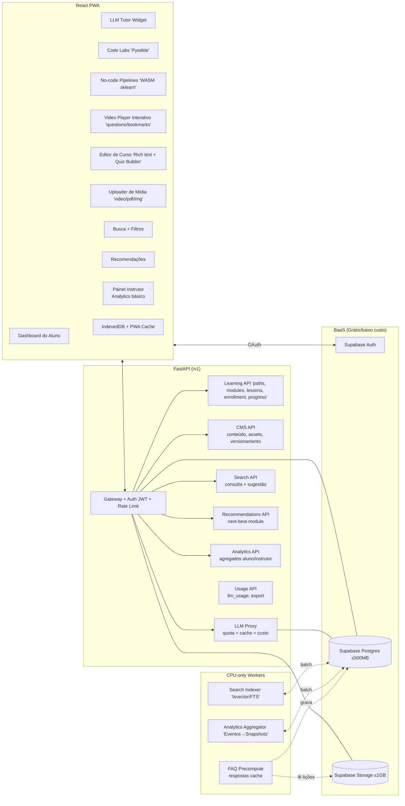
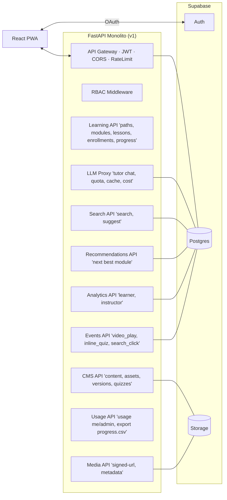
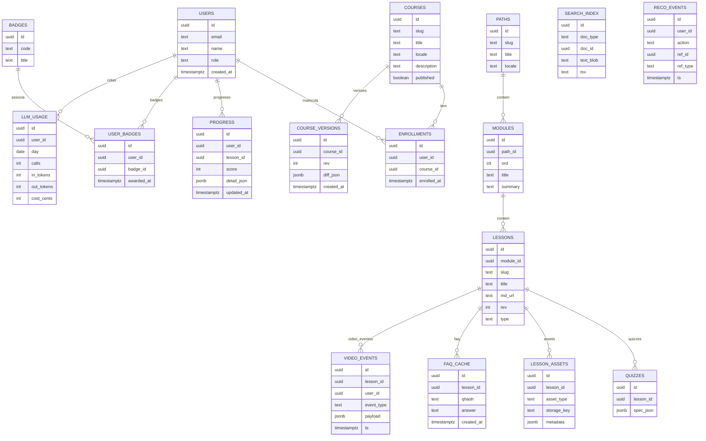
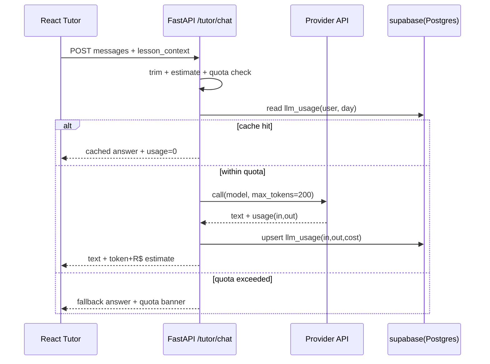
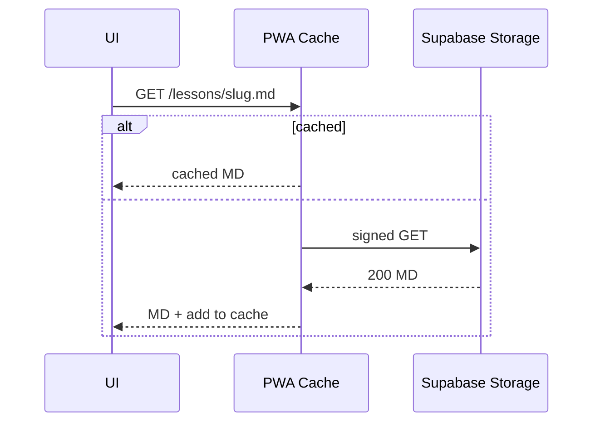
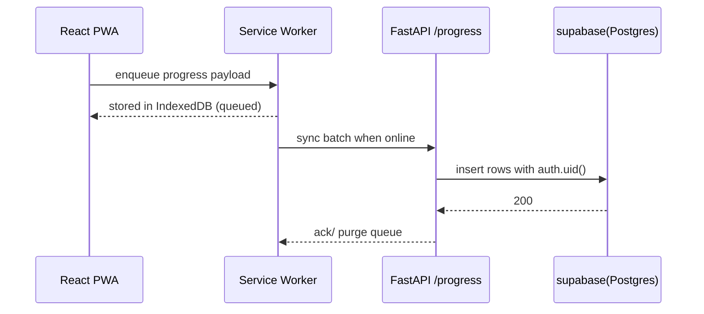
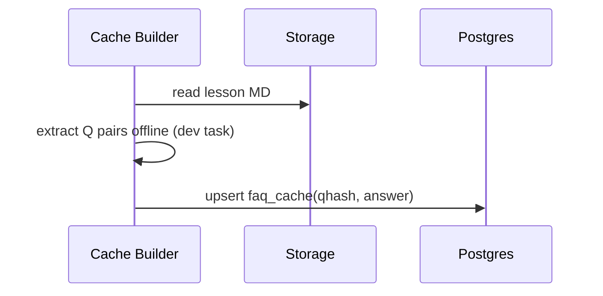

# Arquitetura da Plataforma

Este documento detalha a arquitetura completa da Plataforma de Ensino de IA.

## Visão Geral do Sistema

## Arquitetura do Frontend

```mermaid
graph TD
  App[React PWA 'Vite+TS'] --> Router[React Router]
  App --> Store[Zustand/Context]
  App --> I18N[i18next + A11y]
  App --> PWA[Workbox + IndexedDB]

  Router --> AuthGate
  AuthGate --> Home
  AuthGate --> Dashboard
  AuthGate --> OnboardingQuiz
  AuthGate --> PathSelector
  AuthGate --> ModuleList
  AuthGate --> LessonViewer
  AuthGate --> VideoLesson[Video Player Interativo]
  AuthGate --> TutorWidget
  AuthGate --> CodeLabs[Pyodide]
  AuthGate --> PipelineBuilder[WASM sklearn]
  AuthGate --> SearchPage[Busca + Filtros]
  AuthGate --> RecoPage[Recomendações]
  AuthGate --> ProgressPage
  AuthGate --> InstructorLite
  AuthGate --> CourseEditor[Editor de Curso]
  AuthGate --> MediaManager[Uploader/Gerenciador]
  AuthGate --> Profile

  LessonViewer --> GlossaryPopover
  TutorWidget --> TokenMeter
  TutorWidget --> QuotaBanner
  VideoLesson --> InlineQuiz[Embedded Questions]
  VideoLesson --> Bookmarks[Marcadores/Pontos-chave]

  CodeLabs --> NotebookFrame
  CodeLabs --> TestsPanel

  PipelineBuilder --> BlockLibrary
  PipelineBuilder --> Canvas
  PipelineBuilder --> RunPanel

  CourseEditor --> RichText
  CourseEditor --> QuizBuilder
  CourseEditor --> OutlineManager
  MediaManager --> VideoUpload
  MediaManager --> PdfUpload
  MediaManager --> AssetTable
```

## Arquitetura do Backend

## Modelo de Dados

## Fluxos Principais

### 1. Tutor Chat com Orçamento

### 2. Carregamento de Lição com Cache

### 3. Sincronização Offline de Progresso

### 4. Pré-computação de FAQ

## Decisões Arquiteturais

### Escolha do Stack

- **FastAPI**: Performance Python + OpenAPI docs + async nativo
- **React + Vite**: DX rápido, TypeScript, PWA moderna
- **Supabase**: Free tier generoso, Postgres real, Auth OAuth
- **Pyodide**: Python no browser sem backend
- **WASM**: sklearn/numpy em pipeline visual

### Offline-First

- Service Worker + IndexedDB para lições em cache
- Queue de progresso sincroniza em background
- Fallback gracioso quando API offline

### Custo e Escalabilidade

- Free tier do Supabase (500MB DB, 1GB storage)
- Workers CPU-only (sem GPU)
- LLM quota por usuário + cache de perguntas frequentes

### Segurança

- JWT tokens via Supabase Auth
- Row Level Security (RLS) no Postgres
- Rate limiting no gateway
- CORS configurado

## Próximos Passos

1. Implementar autenticação JWT e RBAC
2. Criar tabelas no Supabase Postgres
3. Desenvolver endpoints modulares (LMS, CMS, etc)
4. Construir componentes React para dashboard e lições
5. Integrar Pyodide para code labs
6. Adicionar PWA offline capabilities com IndexedDB
7. Implementar workers para indexação e analytics
